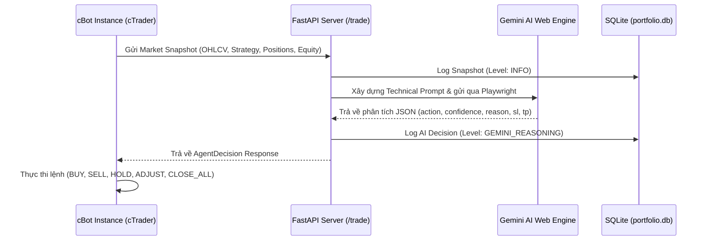

# 🤖 Chiến Thuật: AI Agent Bot Example

---

## 1. Tổng Quan & Triết Lý Chiến Thuật (Overview)
- **Tên cBot**: `AI Agent Bot Example`
- **Cặp tiền chính**: `XAUUSD` (hoặc bất kỳ cặp tiền tệ / Crypto nào)
- **Khung thời gian**: `m1` / `m15`
- **Triết lý cốt lõi**:
  - Đóng vai trò là **Template Mẫu Chuẩn (Reference Implementation)** cho hệ sinh thái cBot kết nối trực tiếp với Python AI Server và Gemini Web.
  - Sử dụng kiến trúc tối giản nhưng đầy đủ các module: Giám sát tài khoản, bảo vệ rủi ro, phân tích chỉ báo cơ bản, và trao quyền tự chủ hoàn toàn cho **Gemini AI Agent** trong việc mở lệnh, điều chỉnh SL/TP động và quản lý vị thế theo thời gian thực.

---

## 2. Hệ Thống Chỉ Báo & Thu Thập Dữ Liệu Kỹ Thuật (TA Engine)

### 2.1. Các Chỉ Báo Kỹ Thuật Tích Hợp
1. **RSI 3 Tầng**:
   - `periodRSI = 33`, `periodRSIshort = 85`, `periodRSIlong = 93`.
2. **TEMA Crossover**:
   - `periodTEMA1 = 147`, `periodTEMA2 = 183`.
3. **Bộ Đo Sức Mạnh Xu Hướng**:
   - `periodADX = 8`, `ATR = 14` (Exponential).
4. **Hệ Thống Đỉnh / Đáy Gần Nhất (Swing High / Swing Low)**:
   - Tự động trích xuất mức đỉnh cao nhất (`recent_high`) và đáy thấp nhất (`recent_low`) trong 20 nến gần nhất để cung cấp vùng cản hỗ trợ/kháng cự cho Gemini AI.

---

## 3. Quy Trình Tương Tác & Ra Lệnh Của Gemini AI

### 3.1. Các Lệnh Thực Thi Từ AI
1. **`BUY` / `SELL`**:
   - Khởi tạo lệnh thị trường với khối lượng `volume_lots` do AI đề xuất.
   - Thiết lập mức cắt lỗ `sl_pips` và chốt lời `tp_pips` theo cấu trúc cản của AI.
2. **`HOLD`**:
   - Tiếp tục duy trì vị thế hiện tại khi xu hướng đang phát triển thuận lợi.
3. **`ADJUST`**:
   - Cập nhật Stop Loss / Take Profit mới cho các lệnh đang mở (Trailing SL theo cấu trúc sóng của AI).
4. **`CLOSE_ALL`**:
   - Đóng toàn bộ các vị thế đang mở ngay lập tức để bảo vệ vốn.

---

## 4. Quản Lý Vốn & Rủi Ro (Risk Management)
- **Tùy chọn Khối Lượng**: Hỗ trợ cố định (`enableFixedVol = true`) hoặc tính theo % rủi ro tài khoản (`_voltoAccount = true`).
- **Bảo Vệ Sụt Giảm Equity (Circuit Breaker)**: Tự động cắt giảm 50% khối lượng rủi ro nếu mức sụt vốn vượt quá `maxEquityDDPercent = 15%`.
- **Hỗ Trợ Quản Trị Đa Lệnh**: Giới hạn tối đa số lệnh mở đồng thời (`maxPermittedOrder = 1`).

---

## 5. Bảng Tham Số Cấu Hình (Parameters Reference)

| Tham Số | Kiểu Dữ Liệu | Mặc Định | Ý Nghĩa |
| :--- | :---: | :---: | :--- |
| `BotId` | `string` | `AI Agent Bot Example` | Tên định danh bot |
| `ApiUrl` | `string` | `http://127.0.0.1:8181/trade` | Địa chỉ API Server |
| `riskFactor` | `double` | `25.0` | Tỷ lệ rủi ro phân bổ (%) |
| `takeprofitPercentage` | `double` | `3.2` | Tỷ lệ chốt lời (%) |
| `stoplossPercentage` | `double` | `1.8` | Tỷ lệ cắt lỗ (%) |
| `enableNewsFilter` | `bool` | `true` | Bật lọc tin tức ForexFactory |
| `enableEquityProtection`| `bool` | `false` | Bật chế độ bảo vệ sụt giảm vốn |
