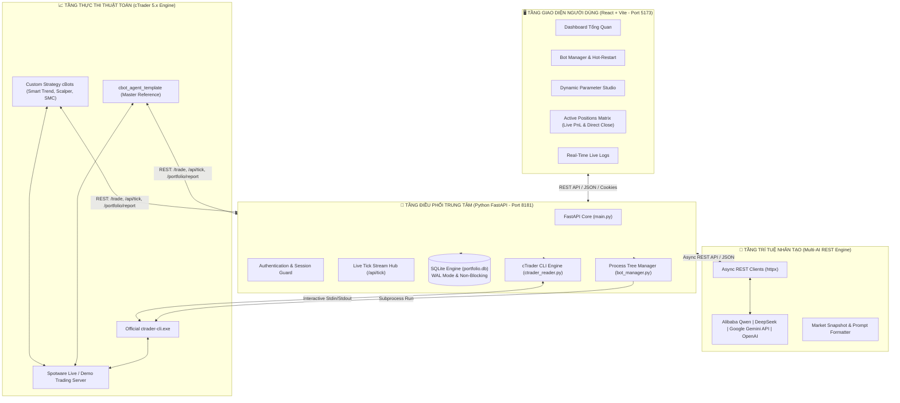

# 🌐 Project Context: cTrader AI Trading Hub

Tài liệu tổng quan bức tranh toàn cảnh (**Project Context & Architecture Blueprint**) của dự án `cTrader-AI-Trading-Hub`. Nơi tập hợp toàn bộ tri thức cốt lõi về mục tiêu, kiến trúc đa tầng, luồng dữ liệu, quy chuẩn phát triển và hướng dẫn vận hành hệ thống.

---

## 1. 🎯 Tổng Quan Dự Án (Executive Summary)

**`cTrader-AI-Trading-Hub`** là một nền tảng giao dịch định lượng lai (**Hybrid AI-Automated Algorithmic Trading Ecosystem**), kết hợp sức mạnh phân tích và tư duy ngữ cảnh của các mô hình trí tuệ nhân tạo (**Google Gemini, Alibaba Qwen, DeepSeek, OpenAI**) với tốc độ thực thi, quản lý vốn và bảo vệ rủi ro miligiây của các thuật toán **cTrader 5.x Automate (cBots)**.

### 🌟 Mục tiêu cốt lõi:
1. **AI Co-Pilot & Decision Engine**: Trí tuệ nhân tạo đóng vai trò chuyên gia tư vấn chiến thuật thời gian thực, tiếp nhận Market Snapshot (OHLCV, EMA, RSI, ATR, Order Book) để đưa ra quyết định vào lệnh (`BUY`, `SELL`), giữ lệnh (`HOLD`), điều chỉnh SL/TP (`ADJUST`) hoặc đóng toàn bộ (`CLOSE_ALL`).
2. **Hạ Tầng Giao Dịch Đa Bot (Multi-Bot Management Hub)**: Quản lý tập trung vòng đời các cBot (Start, Graceful Stop, Hot-Restart, Delete) qua giao diện Web React hiện đại (**Trading Agent Hub**).
3. **Đồng Bộ & Đóng Lệnh Thực Tế Sàn (Direct Broker CLI Integration)**: Đọc sổ lệnh trực tiếp qua `ctrader-cli` và cho phép can thiệp đóng lệnh tức thời trên sàn Spotware Broker với 1 cú click.
4. **Bảo Toàn Vốn Đa Tầng (Multi-Layer Risk Management)**: Circuit Breaker bảo vệ Drawdown, Trailing Stop Loss, Break-Even, Lưới DCA, và Bộ lọc tin tức ForexFactory High-Impact News Filter.

---

## 2. 🏗️ Kiến Trúc Hệ Thống Đa Tầng (Architecture Blueprint)



---

## 3. 📦 Ngăn Xếp Công Nghệ (Technology Stack)

| Thành Phần | Công Nghệ / Thư Viện | Vai Trò & Chức Năng |
| :--- | :--- | :--- |
| **Backend Core** | `Python 3.10+`, `FastAPI`, `Uvicorn` | Máy chủ REST API trung tâm điều phối dữ liệu giữa cBot, Web UI và AI Engine. |
| **AI REST Engine** | `httpx (Async HTTP/2)` | Kết nối trực tiếp siêu tốc tới Qwen (DashScope), DeepSeek, Gemini API, OpenAI. |
| **AI Evaluation** | `ai_eval_harness.py` | Benchmark độc lập đo lường Win Rate %, Profit Factor, độ trễ và kiểm tra rủi ro. |
| **Database** | `SQLite3` (WAL Mode, `busy_timeout=60s`) | Lưu trữ trạng thái tài khoản, vị thế, lịch sử lệnh, nhật ký logs, eval runs. |
| **Frontend UI** | `React 18`, `TypeScript`, `Vite`, `Lucide React` | Giao diện điều khiển tập trung **Trading Agent Hub** với giao diện Dark Mode cao cấp. |
| **cBot Engine** | `C# (.NET 6.0)`, `cTrader Automate 5.x API` | Thuật toán giao dịch tự động trên biểu đồ cTrader, tính toán chỉ báo và gửi snapshot. |
| **Broker CLI** | `ctrader-cli` (Spotware Official CLI) | Khởi chạy bot headless, đồng bộ sổ lệnh broker và thực thi đóng lệnh trực tiếp. |
| **Process Control**| `psutil` | Quản lý vòng đời tiến trình, dừng sạch cây tiến trình con (Recursive Process Tree). |

---

## 4. 🌟 Các Phân Hệ Tính Năng Cốt Lõi (Core Feature Modules)

### 4.1. Bot Manager & Fleet Controls Engine
- **Quản lý đa phiên bản bot**: Hỗ trợ khởi chạy đồng thời nhiều bot trên nhiều tài khoản (`account_id`), cặp tiền (`symbol`), và khung thời gian (`timeframe`) khác nhau.
- **Bộ điều khiển Fleet hàng loạt (Bulk Fleet Controls)**:
  - **`▶️ Start All`**: Tự động lọc và khởi chạy tuần tự các bot đang `STOPPED` trong nền.
  - **`⏹️ Stop All`**: Dừng khẩn cấp toàn bộ các tiến trình bot đang chạy với hộp thoại xác nhận an toàn.
  - **`🔄 Restart All`**: Dừng toàn bộ và khởi động lại tuần tự toàn bộ fleet bot.
- **Cơ chế Staggered Startup (Độ trễ 60 giây)**: Các bot được khởi chạy tuần tự cách nhau 60 giây trong nền bất đồng bộ (`asyncio.create_task` & `await asyncio.sleep(60.0)`), loại bỏ hoàn toàn hiện tượng quá tải CPU và RAM VPS và tránh xung đột xác thực cTrader CLI.
- **Real-Time Fast Polling**: Giao diện tự động quét 3s/lần để cập nhật trạng thái bot chuyển sang màu xanh `RUNNING` trực tiếp trên web theo thời gian thực.
- **Graceful Termination**: Khi người dùng ấn **Stop Bot**, hệ thống quét toàn bộ Process Tree (`psutil.Process(pid).children(recursive=True)`), gửi tín hiệu dừng an toàn và dọn dẹp bộ nhớ triệt để trong 3 giây.
- **Hot-Restart**: Tự động dừng bot cũ, nạp lại cấu hình tham số mới và khởi động lại bot chỉ trong 1 giây mà không làm gián đoạn hệ thống.

### 4.2. Dynamic Parameter Studio
- **Metadata Reflection**: Hệ thống tự động đọc cấu trúc tham số (Parameter Schema) của bất kỳ file `.algo` nào thông qua lệnh `ctrader-cli metadata <path.algo>`.
- **In-Browser Customization**: Cho phép người dùng chỉnh sửa trực quan mọi tham số (EMA periods, RSI, Risk %, SL/TP, DCA, Trailing Stop) trực tiếp trên Web UI và lưu vào `portfolio.db`.

### 4.3. Active Positions Matrix & Live Broker Sync
- **Đồng bộ sổ lệnh thực tế từ sàn**: `ctrader_reader.py` kết nối trực tiếp với Spotware Broker để đọc chính xác 100% vị thế đang mở.
- **Live Tick Telemetry (`/api/tick`)**: Các bot đang chạy truyền dữ liệu giá Bid/Ask theo thời gian thực (1 tick/giây) lên server để tính toán tức thời **Unrealized PnL ($ / Pips)** mà không cần đợi nến đóng.
- **Đóng lệnh thực tế trên Broker**: Tích hợp nút **Close** từng lệnh và **🚨 Close All Positions**: Gửi lệnh `position close <id> yes` trực tiếp lên máy chủ Spotware và tự động cập nhật lại cơ sở dữ liệu.

### 4.4. Gemini & Multi-AI Decision Engine
- **Market Snapshot Payload**: Đóng gói 100 nến gần nhất (OHLCV), các giá trị chỉ báo kỹ thuật (TEMA, RSI, ADX, ATR, Đỉnh/Đáy gần nhất, Cấu trúc Swing HH/HL/LH/LL đa khung thời gian), danh sách lệnh mở và thông tin vốn tài khoản.
- **Prompt Formulation & Reasoning**: Định dạng dữ liệu thành prompt chuyên sâu gửi vào Multi-AI REST Engine để phân tích xu hướng thị trường và trả về hành động đề xuất kèm mức độ tự tin (Confidence %).
- **Main Thread Decision Execution**: Toàn bộ quyết định từ AI (`BUY`, `SELL`, `HOLD`, `ADJUST`, `CLOSE_ALL`) được thực thi trên Main Thread của cTrader thông qua `BeginInvokeOnMainThread`.

### 4.5. Quản Trị Rủi Ro Đa Tầng & Smart Position Protection
- **Positive Trailing SL Auto-Mapping**: Tự động nhận diện khi AI đề xuất mức TP nằm giữa Entry và Giá thị trường để chuyển thành Trailing SL dương khóa lãi, đồng thời bảo tồn mục tiêu TP cấu trúc ban đầu.
- **Hybrid Smart SL Protection Engine**: Khi AI đề xuất SL vi phạm khoảng cách giá thị trường: tự động đóng lệnh chốt lãi ngay nếu lệnh đang dương; hoặc giữ nguyên SL ban đầu nếu lệnh đang âm để tránh Stop-out non và lỗi từ chối của sàn broker.
- **ForexFactory News Filter (2 tầng dự phòng)**: Tự động tải lịch tin tức đỏ High-Impact (ưu tiên JSON, tự động fallback sang XML khi gặp lỗi mạng/429), ngưng mở lệnh trước và sau giờ ra tin.
- **High-Watermark Drawdown Circuit Breaker**: Tự động theo dõi đỉnh vốn cao nhất và tự động cắt giảm 50% khối lượng rủi ro nếu mức sụt giảm chạm ngưỡng cho phép.
- **Bảo toàn vị thế**: Tự động dời Stop Loss về Break-Even khi đạt điểm kích hoạt, kết hợp Trailing Stop Loss và cơ chế bình quân giá DCA Grid thông minh.

---

## 5. 📁 Cấu Trúc Thư Mục Dự Án (Project Structure)

```
cTrader-AI-Trading-Hub/
├── .agents/                                # Agent Skills & Quy chuẩn dự án
│   ├── AGENTS.md                           # Master Workspace Rules & Coding Standards
│   ├── rules/                              # Các tài liệu quy tắc chuyên biệt
│   │   └── cbot_template_and_generator_rule.md # Quy tắc tạo bot và đồng bộ mẫu gốc
│   └── skills/                             # Hệ thống Agent Skills
│       ├── ctrader-cbot-generator/         # Skill khởi tạo cBot mới tự động
│       ├── ctrader-cbot-compiler/          # Skill biên dịch cBot (.csproj -> .algo)
│       ├── ctrader-cbot-backtester/        # Skill Backtest chính thức qua cTrader CLI
│       ├── ctrader-cbot-optimizer/         # Skill tối ưu tham số 2 bước (Grid Search)
│       ├── ctrader-cbot-reviewer/          # Skill rà soát bảo mật & compliance code
│       └── ctrader-telegram-notifier/      # Skill gửi báo cáo tự động lên Telegram
├── cbot/                                   # Mã nguồn các cBot giao dịch
│   ├── cbot_agent_template/                # Master Reference Template cBot
│   │   ├── cbot_agent_template.sln         # Solution cTrader 5.x Native
│   │   └── cbot_agent_template/
│   │       ├── cbot_agent_template.cs      # Mã nguồn C# duy nhất của bot mẫu
│   │       ├── cbot_agent_template.csproj  # MSBuild project file
│   │       └── GlobalUsings.cs             # Global usings
│   ├── Smart Trend and AI Agent XAU M15/   # cBot chiến thuật xu hướng vàng M15
│   └── AI Agent Bot Example/               # cBot mẫu cơ bản
├── docs/                                   # Tài liệu chiến thuật và kiến trúc
│   ├── projectcontext.md                   # Bức tranh toàn cảnh dự án (Tệp này)
│   ├── README.md                           # Mục lục thư viện tài liệu
│   ├── cbot_agent_template.md              # Tài liệu chi tiết bot template mẫu
│   └── Smart_Trend_and_AI_Agent_XAU_M15.md # Tài liệu chiến thuật Smart Trend
├── frontend/                               # Giao diện Web Trading Hub (React + TypeScript)
│   ├── src/
│   │   ├── components/                     # Các components (ActivePositions, BotManager,...)
│   │   ├── App.tsx                         # Ứng dụng chính
│   │   └── Dashboard.tsx                   # Bảng điều khiển Trading Agent Hub
│   ├── package.json                        # Dependencies Node.js
│   └── vite.config.ts                      # Cấu hình Vite
├── bot_manager.py                          # Module quản lý tiến trình bot (psutil)
├── ctrader_reader.py                       # Module giao tiếp CLI với Broker Spotware
├── database.py                             # Module khởi tạo & quản lý kết nối SQLite WAL
├── ai_engine.py                            # Module kết nối Multi-AI REST API (Qwen, DeepSeek, Gemini, OpenAI)
├── ai_eval_harness.py                      # Module AI Evaluation & Forward Benchmark Harness
├── main.py                                 # Máy chủ FastAPI trung tâm & AI Router
├── requirements.txt                        # Danh sách thư viện Python
├── MILESTONES.md                           # Nhật ký các cột mốc phiên bản ổn định
├── run.bat                                 # Script 1-Click khởi chạy toàn bộ hệ thống
├── frontend_build.bat                      # Script biên dịch giao diện React sang tĩnh
├── gitPull-Force.bat                       # Script 1-Click ép đồng bộ mới nhất từ origin
└── install.bat                             # Script cài đặt môi trường ban đầu
```

---

## 6. 📜 Quy Chuẩn Lập Trình & Phát Triển Bắt Buộc (Mandatory Rules)

### 1. Quy chuẩn kiến trúc cTrader 5.x Native
- Mọi cBot phải được đặt trong cấu trúc: `<BotName>/<BotName>.sln` và `<BotName>/<BotName>/<BotName>.cs`.
- Cho phép cTrader Automate App hiển thị và chỉnh sửa trực tiếp 100% mã nguồn trên giao diện cTrader Desktop.

### 2. Tiêu chuẩn Zero Warning & Clean Build
- Mọi cBot khi biên dịch bằng `dotnet build` hoặc `ctrader-cli build` phải đạt **0 Errors, 0 Warnings**:
  - `private readonly bool Unlimited_License` để loại bỏ cảnh báo CS0162.
  - `#pragma warning disable SYSLIB0014` cho HttpWebRequest.
  - `#pragma warning disable CS0618` cho ModifyPosition.

### 3. Quy tắc đồng bộ ngược mẫu gốc liên tục (Continuous Template Sync Rule)
- **MANDATORY**: Bất kỳ khi nào có chỉnh sửa code, nâng cấp tính năng, tối ưu hóa hoặc vá lỗi hệ thống (Bug Fix) trên **bất kỳ cBot nào** trong repository (như xử lý an toàn luồng Main Thread, tin tức ForexFactory Fallback, SQLite WAL non-blocking, Chart headless null-check,...), thay đổi đó **PHẢI ĐƯỢC ĐỒNG THỜI CẬP NHẬT NGƯỢC LẠI CHO `cbot_agent_template`**.

### 4. Quy tắc an toàn luồng Main Thread (Main Thread Safety)
- Toàn bộ việc truy cập dữ liệu cTrader API (`Positions`, `Account`, `Symbol`) bắt buộc phải thực hiện đồng bộ trên **Main Thread** trước khi chuyển dữ liệu thô (chuỗi JSON) sang `Task.Run` chạy ngầm.

### 5. Tiêu chuẩn Backtesting & Optimization bằng cTrader CLI
- Mọi tác vụ kiểm thử quá khứ (Backtest) và tối ưu tham số (Optimization) bắt buộc phải sử dụng chính thức `ctrader-cli` với dữ liệu tick M1 (`--data-mode=m1-csv`), spread chuẩn 15 pips (`--spread=15`), commission $30/mil (`--commission=30`) và balance $1,000 (`--balance=1000`).

---

## 7. 📑 Lịch Sử Cột Mốc Phiên Bản Ổn Định (Milestones Index)

| Phiên Bản / Tag | Commit Hash | Ngày Hoàn Thành | Trạng Thái | Điểm Nhấn Cốt Lõi |
| :--- | :---: | :---: | :---: | :--- |
| **`v1.8.0-bulk-fleet-control`** | [`2d06bdb`](https://github.com/nvcong89/cTrader-AI-Trading-Hub/commit/2d06bdb) | 01/09/2026 | ⭐ **Ổn định** | Ra mắt **Bulk Fleet Controls (Start/Stop/Restart All)** với **60s Staggered Startup**, Realtime Fast Polling & Smart Trailing SL Protection |
| **`v1.7.0-agent-ai-hub`** | [`0c2c84d`](https://github.com/nvcong89/cTrader-AI-Trading-Hub/commit/0c2c84d) | 27/08/2026 | ⭐ **Ổn định** | Ra mắt **Tab "Agent AI"**, Đa nguồn AI (**Gemini Web, Gemini API, DeepSeek R1/V3, OpenAI**) & Live Ping |
| **`v1.6.2-real-broker-close`** | [`0c2c84d`](https://github.com/nvcong89/cTrader-AI-Trading-Hub/commit/0c2c84d) | 26/08/2026 | ⭐ **Ổn định** | Đóng lệnh **thực tế trực tiếp trên Broker Spotware** qua cTrader CLI engine |
| **`v1.6.1-stability-fix`** | [`a2d2fc1`](https://github.com/nvcong89/cTrader-AI-Trading-Hub/commit/a2d2fc1) | 26/08/2026 | ⭐ **Ổn định** | Khắc phục triệt để hiện tượng chập chờn / biến mất lệnh (Multi-bot isolation) |
| **`v1.6.0-live-tick-telemetry`**| [`c3769f3`](https://github.com/nvcong89/cTrader-AI-Trading-Hub/commit/c3769f3) | 26/08/2026 | ⭐ **Ổn định** | Stream **Live Tick Telemetry (`/api/tick`)** & Live Unrealized PnL thời gian thực |
| **`v1.5.1-pnl-sltp-fix`** | [`d1e972b`](https://github.com/nvcong89/cTrader-AI-Trading-Hub/commit/d1e972b) | 26/08/2026 | ⭐ **Ổn định** | Hiển thị giá SL/TP chính xác & Tự động tính Unrealized Live PnL ($ / Pips) |
| **`v1.5.0-cli-broker-sync`** | [`c75f6da`](https://github.com/nvcong89/cTrader-AI-Trading-Hub/commit/c75f6da) | 26/08/2026 | ⭐ **Ổn định** | Tích hợp **Direct cTrader CLI Broker Sync** đọc sổ lệnh trực tiếp từ sàn |
| **`v1.4.0-positions`** | [`6d350c9`](https://github.com/nvcong89/cTrader-AI-Trading-Hub/commit/6d350c9) | 26/08/2026 | ⭐ **Ổn định** | Ra mắt **Active Positions Matrix Tab**, Nút Close lẻ & 🚨 Close All Positions |
| **`v1.3.0-template`** | [`642c4ca`](https://github.com/nvcong89/cTrader-AI-Trading-Hub/commit/642c4ca) | 26/08/2026 | ⭐ **Ổn định** | Ra mắt Master `cbot_agent_template`, Skill & Rule tạo bot tự động |
| **`v1.2.0-stable`** | [`bc85fb4`](https://github.com/nvcong89/cTrader-AI-Trading-Hub/commit/bc85fb4) | 26/08/2026 | ⭐ **Ổn định** | Ra mắt Dynamic Parameter Studio, Hot-Restart bot, sửa lỗi CLI headless |
| **`v1.1.0-stable`** | [`348fcce`](https://github.com/nvcong89/cTrader-AI-Trading-Hub/commit/348fcce) | 26/08/2026 | ⭐ **Ổn định** | Thiết lập thư mục `docs/` & Quy chuẩn tài liệu chiến thuật cho từng bot |
| **`v1.0.0-core`** | [`449e888`](https://github.com/nvcong89/cTrader-AI-Trading-Hub/commit/449e888) | 26/08/2026 | ⭐ **Ổn định** | Nâng cấp toàn diện Bot Manager, cBot Library Discovery & Gemini Web Bridge |

---

## 8. 🚀 Hướng Dẫn Vận Hành & Khởi Chạy (Quick Start Guide)

### 1. Cài đặt môi trường ban đầu
Nhấp đúp vào file `install.bat` để hệ thống tự động:
- Tạo môi trường ảo Python `venv` và cài đặt `requirements.txt`.
- Cài đặt các gói NPM trong `frontend/`.

### 2. Khởi chạy hệ thống 1-Click
Nhấp đúp vào file `run.bat`:
- Server tự động khởi động:
  - **Backend API**: `http://127.0.0.1:8181`
  - **Frontend Trading Hub**: `http://localhost:5173`

### 3. Cập nhật code mới nhất từ xa
Nhấp đúp vào file `gitPull-Force.bat` để tự động kéo toàn bộ commit mới nhất từ GitHub mà không làm mất thông tin tài khoản và cơ sở dữ liệu giao dịch cục bộ.
